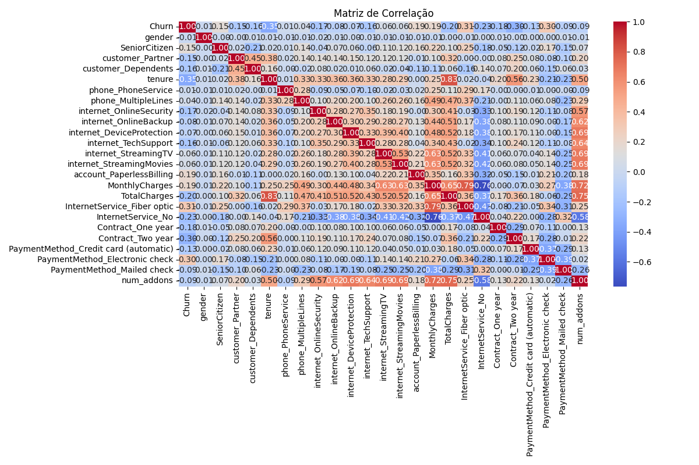
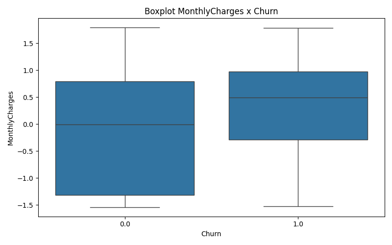

# Telecom X - Parte 2: Prevendo Churn de Clientes

Bem-vindo ao projeto **Telecom X - Parte 2**, desenvolvido para prever a evasão de clientes (churn) em uma empresa de telecomunicações usando técnicas de Machine Learning.

## 🚀 Propósito do Projeto

O objetivo principal deste projeto é **antecipar o churn de clientes**, ou seja, identificar quais usuários têm maior risco de cancelar seus serviços, utilizando variáveis relevantes do histórico de relacionamento com a empresa. Essa previsão permite ações estratégicas de retenção, evitando perda de receita e melhorando a experiência do cliente.

---

## 📁 Estrutura do Projeto

- **`notebook_telecomx_churn.ipynb`**: Notebook principal, com todo o pipeline — da exploração à modelagem.
- **`dados_telecomX.csv`**: Base de dados original.
- **`dados_tratados.csv`**: (Opcional) Versão limpa e pré-processada dos dados, pronta para análise e modelagem.
- **`/visualizacoes`**: Pasta com gráficos gerados durante a análise exploratória (EDA), como heatmaps e distribuições.

---

## ⚙️ Processo de Preparação dos Dados

### 1. **Classificação das Variáveis**
- **Numéricas:** `tenure`, `MonthlyCharges`, `TotalCharges`, etc.
- **Categóricas:** `gender`, `Partner`, `Dependents`, `PaymentMethod`, entre outras.
- **Identificadoras:** `customerID` (apenas para referência, não entra no modelo).

### 2. **Tratamento e Pré-Processamento**
- Remoção de valores nulos ou inconsistentes.
- Codificação de variáveis categóricas usando **Label Encoding** (ideal para modelos baseados em árvore) ou **One-Hot Encoding** (opcional para outros modelos).
- Normalização das variáveis numéricas via **StandardScaler** para garantir escala equivalente entre as features.

### 3. **Separação dos Dados**
- **Treino/Teste:** Divisão dos dados em 70% para treino e 30% para teste, usando `train_test_split`, garantindo que o modelo seja avaliado de forma justa e sem vazamento de informações.

### 4. **Justificativas das Escolhas**
- **Remoção de `customerID`:** É só identificador, não carrega valor preditivo.
- **Normalização:** Essencial para algoritmos sensíveis à escala, como regressão logística.
- **Label Encoding:** Menos colunas que One-Hot, mais eficiente para Random Forest, sem perda de informação quando não há ordem natural.
- **Divisão treino/teste:** Mantém avaliação realista e evita overfitting.

---

## 📊 Exemplos de Gráficos & Insights (EDA)

- **Matriz de Correlação:**  
  
- **Distribuição do tenure:**  
  
- **Boxplot MonthlyCharges x Churn:**  
  

**Insights-chave:**
- Clientes com `tenure` baixo e `TotalCharges` baixo têm maior propensão a churn.
- `MonthlyCharges` alto também está relacionado a taxas maiores de churn.
- Variáveis como `Contract` e `PaymentMethod` têm impacto relevante no modelo.

---

## ▶️ Como Executar o Notebook

1. **Clone o repositório ou faça upload dos arquivos no Google Colab.**

2. **Instale as bibliotecas necessárias:**

```python
!pip install pandas numpy scikit-learn matplotlib seaborn
